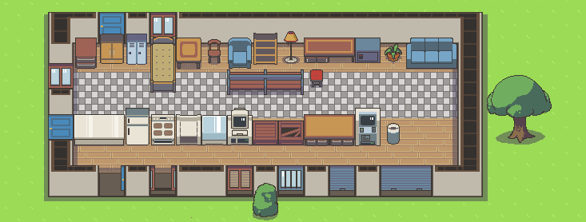

# Cuteclysm
A tileset for the roguelike Cataclysm:Dark Days Ahead. With a clean, cute and minimalist visual style inspired by 16-bit era JRPGs.

## Style Guide

### General Rules
General rules that guide the style of all sprites in the tileset:

### Color Pallete

Cuteclysm doesnt have a well established color pallete. When it comes to terrains and furniture, its best to pick a color from the image above, or to use colors that integrate well into it. The reference image can be found in `screenshots/tileset-reference.png`

#### Top and Front Perspective

Cuteclysm renders the world in a three-quarters view that shows the top and front faces of every object.  Taller objects show a larger front and a shorter top, while the top face is more prevalent in shorter objects.

#### Simple Geometry
 

Sprites should have a simplified geometries and easy to distinguish silluethes. When in doubt, make your sprite look more like an icon than a photograph.

#### Avoid black outlines

  

Black or very dark outlines shouldn't be used. Instead, use a less-saturated, darker color taken from the sprite's pallete

### Flat and spotless textures.
  

Objects should be flat colored, or have textures that are as simple as possible. Paint or airbrush like effects shouldn't be used.

A gritty aesthetic should be avoided: objects shouldnt normally show grime, blood or signs of wear damage.

### Lightning

The global illumination comes directly from above. So objects cast shadows only on the terrain that lies directly underneath them.

The color used for cast shadows is HEX: #49425A at 50% opacity. The form shadows of objects can be painted with any color of similar values.  Black shadows shouldn't be used.
